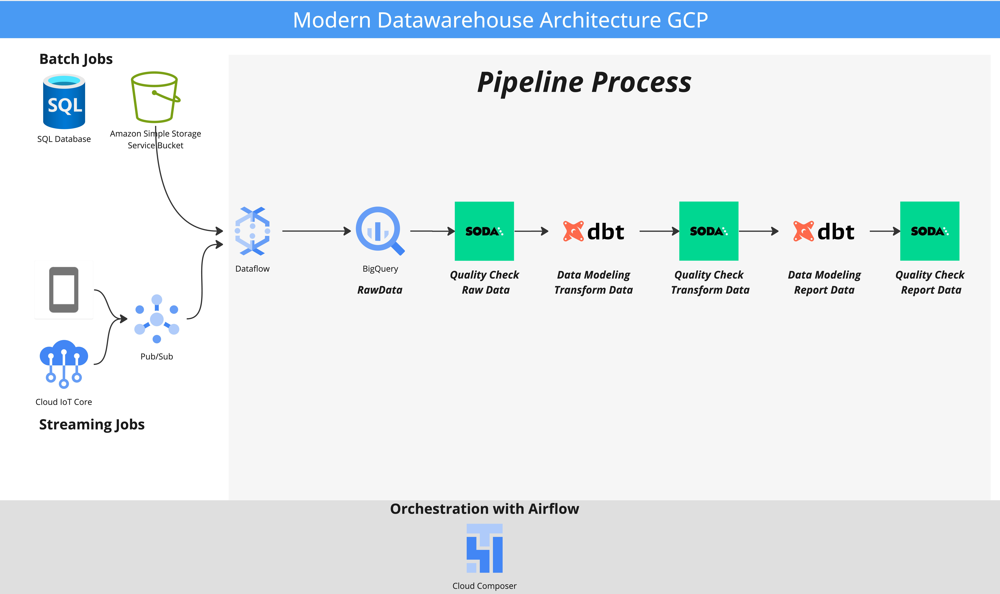

Overview
========

Welcome Liga Spain Project! 
This project create a Modern Data Warehouse Architecture simulated with a Liga Spain Data. Using different tools like Airflow, BigQuery, Dataflow (Apache Beam), DBT, Soda.

Project Contents
================

Your Astro project contains the following files and folders:

- dags: This folder contains the Python files for DAGs of this project.
- Dockerfile: This file contains a versioned Astro Runtime Docker image. It's used for running Airflow in Local
- include: This folder contains all the logic of the project in the different sections: 
    - dataset: All the data using in this project.
    - dbt: All the logic of the dbt project.
    - gcp: All the logic of the gcp project, also the apache beam code.
    - soda: All the logic of the soda project.

- requirements.txt: Install Python packages needed for your project by adding them to this file. It is empty by default.
- airflow_settings.yaml: Use this local-only file to specify Airflow Connections, Variables, and Pools instead of entering them in the Airflow UI as you develop DAGs in this project.

Deploy Your Project Locally
===========================

1. Start Airflow on your local machine by running 'astro dev start'.

This command will spin up 4 Docker containers on your machine, each for a different Airflow component:

- Postgres: Airflow's Metadata Database
- Webserver: The Airflow component responsible for rendering the Airflow UI
- Scheduler: The Airflow component responsible for monitoring and triggering tasks
- Triggerer: The Airflow component responsible for triggering deferred tasks

2. Verify that all 4 Docker containers were created by running 'docker ps'.

Note: Running 'astro dev start' will start your project with the Airflow Webserver exposed at port 8080 and Postgres exposed at port 5432. If you already have either of those ports allocated, you can either [stop your existing Docker containers or change the port](https://docs.astronomer.io/astro/test-and-troubleshoot-locally#ports-are-not-available).

3. Access the Airflow UI for your local Airflow project. To do so, go to http://localhost:8080/ and log in with 'admin' for both your Username and Password.

You should also be able to access your Postgres Database at 'localhost:5432/postgres'.

Contact
=======

Jaime Salas
[LinkedIn](https://www.linkedin.com/in/jaimeandresalas/)

